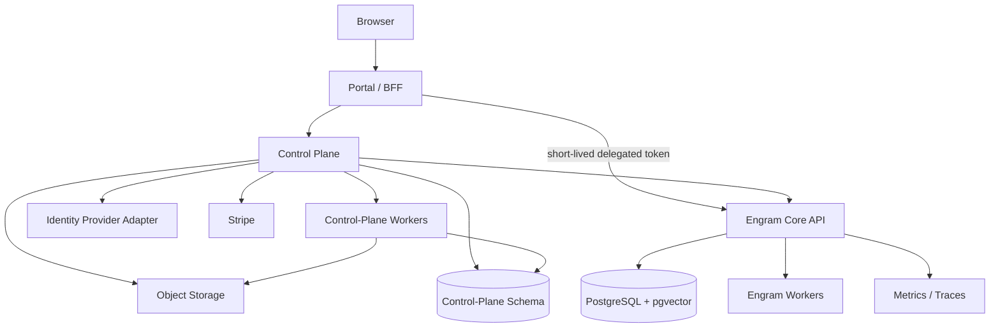

# Engram Hosted Platform and Portal Reference

**Status:** Planning reference — current state, target state, and roadmap  
**Date:** 2026-07-15  
**Repository baseline:** `Zutfen-LLC/engram@8a4f252c28a7bc9fe5b5888c5451366c0e138135`  
**Authority:** `docs/design.md` remains authoritative for Core architecture and trust semantics. `docs/plans/post-remediation-verification-2026-07.md` remains authoritative for core release gates. This document is authoritative only for hosted-platform planning once accepted.

> This document separates **what is implemented** from **what the hosted product should become**. Use it to draft epics, ADRs, issues, and acceptance criteria. Do not interpret target-state sections as implemented behavior.

## 1. Purpose

Engram now has enough of the memory data plane to begin designing the hosted product around it. The hosted product is not merely a web UI. It includes:

- global human identity, tenant membership, OAuth, local login, MFA, recovery, and browser sessions;
- Stripe subscriptions, invoices, entitlements, quotas, and billing reconciliation;
- self-service workspaces, agent groups, agents, API keys, and onboarding bundles;
- memory browsing, review, import, export, lifecycle, and deletion;
- global and per-account operations, security, support, abuse controls, and statistics;
- the launch capabilities that make Engram more than a generic memory dashboard.

Before drafting work from this plan, confirm the relevant current-state claim against `origin/main`, open PRs/issues, current CI, and live evidence where a live claim is required.

## 2. Product and architecture decision

Build three cooperating surfaces:

1. **Engram Core — memory data plane**
   - remains the source of truth for tenant-scoped principals, API keys, memories, trust, review, provenance, recall, graph, jobs, and RLS;
   - remains independently usable as the self-hosted product.

2. **Engram Control Plane — SaaS business and identity plane**
   - owns global users, identities, memberships, invitations, browser sessions, billing, subscriptions, entitlements, quotas, transfers, security events, feature flags, and platform operations;
   - provisions and administers Core only through secured service APIs.

3. **Engram Portal — browser application**
   - exposes separate customer and platform-operator experiences;
   - uses secure browser sessions and short-lived delegated Core authorization;
   - never accesses memory tables directly or retrieves a stored API-key secret.

The first deployment may share a repository and PostgreSQL cluster, but these remain hard architectural boundaries.



A practical repository shape is:

```text
apps/
  portal/
services/
  control-plane/
engram/
packages/
  portal-sdk/
  ui/
docs/
  plans/
  adr/
```

## 3. Non-negotiable invariants

1. PostgreSQL, pgvector, append-first memory content, tenant RLS, and the trust/review model remain foundational.
2. Browser authentication is not represented by a long-lived Engram API key.
3. Agent API keys remain credentials for agents and service integrations.
4. A platform operator is not a tenant administrator; platform and tenant roles are separate.
5. The portal never writes directly to Core tenant, principal, workspace, key, or memory tables.
6. Missing lifecycle operations become secured, typed, audited Core APIs before portal implementation.
7. Billing and entitlement state may restrict operations but must not silently alter trust, authority, review state, provenance, or ranking.
8. Diagnostic telemetry is not automatically billable telemetry.
9. Downgrade, payment failure, or quota enforcement never silently deletes data.
10. API-key secrets are generated server-side, displayed once, stored only as indexed ID plus digest, and never re-retrieved.
11. Support access is deny-by-default, reason-bound, time-limited, step-up authenticated, and auditable.
12. The Context Ledger proves what Engram served and which policy admitted it; it does not certify factual truth or prove agent causality.

## 4. What is versus what should be

| Domain | What is at the baseline | What should be | Gap |
|---|---|---|---|
| Core memory service | FastAPI/PostgreSQL data plane with RLS, trust, review, recall, jobs, SDK, MCP | Remains the governed memory system of record | Preserve/extend |
| Human identity | API-key callers; no global browser-user model | Global users, linked identities, sessions, MFA, recovery, memberships | Missing |
| Tenant administration | Admin create primitives; limited self-service agents | Invitations, roles, ownership, workspace lifecycle, policy administration | Partial |
| Agent fleet | Create/list/revoke-all agents with one-time key | Groups, edit/archive, workspace grants, per-key lifecycle and security activity | Partial |
| Browser authorization | None | Secure cookie session plus short-lived delegated Core authorization | Missing |
| Billing | No Stripe or subscriptions | Checkout, subscription mirror, invoices, reconciliation, customer portal | Missing |
| Entitlements | No plan capability engine | Versioned features/limits enforced at request and job boundaries | Missing |
| Usage | Append-only diagnostic usage and economics reports | Separate authoritative billable events, rollups, quotas, corrections | Substrate only |
| Memory management | Rich APIs; no customer UI | Memory console, review center, saved views, safe bulk workflows | UI missing |
| Import/export | CCA projection and MemPalace CLI | Async transfers, native packet, previews, adapters, expiring artifacts | Partial |
| Platform operations | Health, logs, jobs, reports | Global/per-tenant dashboards, job ops, SLOs, support, abuse controls | Missing surface |
| Data lifecycle | Invalidate/archive; hard delete and portability incomplete | Hard delete, purge, tenant snapshot, retention, PITR | Partial/missing |
| Context Ledger | Recall logs without exact finalized served snapshots | Durable manifests, hashes, inspect/verify/diff, exposure queries | Missing flagship |
| Temporal/explainability | Audit and temporal fields exist internally | Explain dossier, history, as-of recall, change feed | Substrate present |
| Consolidation/expertise | Not implemented | Governed consolidation, canonical duplicates, reliability/quorum | Strategic future |

## 5. Current-state reference

### 5.1 Implemented in Core

- tenant, workspace, principal, workspace-membership, memory, event, graph, job, classification, embedding, feedback, candidate-ingest, and usage-event models;
- non-owner tenant RLS with `FORCE ROW LEVEL SECURITY`;
- API-key authentication with `read`, `write`, `review`, `export`, and `admin` scopes;
- governed review/verification, authority, attribution, recall/search, conflict handling, memory kinds, and asynchronous enrichment;
- Python SDK, MCP adapter, Hermes integration work, Compose deployment, and PostgreSQL-backed CI;
- admin create endpoints for tenants, workspaces, principals, and one-time API keys;
- tenant self-service create/list/revoke-all for agents;
- CCA-lite export and MemPalace CLI import;
- append-only usage telemetry and reports for pricing research.

### 5.2 Explicitly absent or incomplete

- browser users, memberships, invitations, OAuth, email/password, MFA, sessions, recovery, and account linking;
- Stripe, subscription state, entitlements, quotas, invoice/payment UX, and reconciliation;
- self-service workspace lifecycle and human role administration;
- agent groups and complete agent/key lifecycle;
- individual key list, expiry, rotation, overlap, last-used, and authentication audit;
- customer memory/review UI;
- asynchronous transfer jobs and full-fidelity tenant packet;
- platform dashboards, job operations, support workflow, and tenant suspension;
- authoritative billing meters;
- context receipts and exact served-packet verification.

The existing `usage_events` ledger is an observability/economics substrate, not an invoice ledger.

Current recall logs can answer partial historical membership questions such as “was item X returned?” They cannot guarantee exact reconstruction of the finalized served packet after mutable metadata, configuration, policy, code, or content availability changes.

## 6. Target platform contracts

### 6.1 Human identity and membership

Add control-plane entities:

```text
portal_users
user_identities
browser_sessions
tenant_memberships
tenant_invitations
portal_principal_links
security_events
```

Model:

```text
one portal user
  -> many external identities
  -> many tenant memberships
  -> one linked Engram user principal per tenant
```

`portal_principal_links` maps `(portal_user_id, tenant_id)` to the tenant-local Engram principal used in Core audit events.

Hosted production should prefer a managed CIAM unless an ADR explicitly accepts credential, MFA, recovery, linking, and session-security ownership. Future self-hosted portal support should use generic OIDC. “Local auth” initially means email/password is available, not necessarily that Engram stores password hashes.

### 6.2 Browser-to-Core authorization

Use a secure HTTP-only browser session and a short-lived delegated Core token or equivalent backend exchange. Minimum claims:

```json
{
  "iss": "engram-control-plane",
  "aud": "engram-core",
  "sub": "portal-user-id",
  "tenant_id": "tenant-id",
  "principal_id": "engram-principal-id",
  "capabilities": ["memory.read", "memory.review"],
  "session_id": "browser-session-id",
  "mfa": true,
  "auth_time": 1784140000,
  "exp": 1784140300,
  "jti": "unique-token-id"
}
```

Core still verifies tenant/principal state before applying RLS.

### 6.3 Tenant roles and step-up

Initial human roles:

| Role | Primary authority |
|---|---|
| Owner | organization lifecycle, ownership transfer, all tenant administration |
| Administrator | members, workspaces, agents, groups, policy, security |
| Developer | agents, keys, integrations, memory read/write tools |
| Reviewer | review queues, verification, conflict decisions |
| Billing administrator | subscription, invoices, payment, usage; no memory content |
| Viewer | read-only eligible dashboards and memories |

Roles map to explicit capabilities, not directly to the five API-key scopes.

Require MFA/step-up for platform access, ownership changes, member administration, key creation/rotation/scope expansion, full exports, hard deletion, billing-owner changes, tenant deletion, and support break-glass access.

### 6.4 Stripe, entitlements, and billing

Stripe owns payment collection and subscription objects. Engram owns product entitlements and enforcement.

Control-plane entities:

```text
plan_catalog
plan_versions
entitlement_definitions
plan_entitlements
stripe_price_mappings
billing_accounts
subscription_mirrors
stripe_events
entitlement_snapshots
billing_adjustments
```

Webhook processing must verify the raw-body signature, store event IDs idempotently, acknowledge quickly, process asynchronously, update a local mirror, calculate a versioned entitlement snapshot, emit `entitlements.changed`, and reconcile periodically.

Recommended state behavior:

| State | Behavior |
|---|---|
| Trialing/active | normal entitled access |
| Past due | grace period and warnings |
| Unpaid | restrict new writes/costly enrichment; preserve temporary read/export |
| Canceled | stop new use after effective date; retain data by policy |
| Abuse suspension | controlled immediate restrictions with audit evidence |

Downgrades block additional creation when over limit; they do not delete existing data.

Feature and limit keys are data-driven, for example:

```text
memory.context_receipts
memory.explain
memory.time_travel
memory.consolidation
agent.max_count
agent_group.max_count
workspace.max_count
api_key.max_active
usage.ingest_monthly
usage.retrieval_monthly
storage.retained_memories
```

Add a separate billing contract:

```text
meter_definitions
billable_events
usage_rollups_hourly
usage_rollups_daily
quota_counters
billing_adjustments
```

Every billable event has a source event, quantity, meter version, pricing version, timestamps, and correction linkage. A diagnostic usage row is not automatically billable.

### 6.5 Agent fleet and key lifecycle

Customers should be able to:

- create, rename, disable, archive, and restore agents;
- create groups and assign agents/groups to workspaces;
- attach default scopes, expiry, and quota policy to groups;
- list key metadata without secrets;
- issue additional least-privilege keys;
- rotate with explicit overlap/cutover;
- revoke one key or all keys;
- inspect last-used and recent authentication/security activity;
- generate agent-specific onboarding bundles.

Agent groups are initially a management/policy construct. Workspace remains the memory visibility boundary. Do not add `visibility=group` without a complete use case and RLS design.

### 6.6 Memory console and review center

Provide:

- browse, keyword/semantic/hybrid search, filters, saved views, and stable citations;
- detail pages with content, provenance, events, trust vector, lineage, recall usage, conflict state, and receipt exposure;
- safe metadata edits, verification, dispute, supersession, invalidation, and archival proposals;
- proposed/conflicting/stale/import/consolidation queues;
- reviewer assignments, reasons, previews, and bounded bulk actions.

### 6.7 Transfers and native packet

Create asynchronous `transfer_jobs`, artifacts, counts, errors, and adapter-version records with:

```text
created -> uploading -> scanning -> parsing -> preview_ready
-> awaiting_confirmation -> applying -> reconciling
-> succeeded | failed | canceled
```

Adapter contract:

```text
detect -> inspect -> normalize -> validate -> preview -> apply
```

Initial order: Engram native packet, MemPalace, CCA lite, JSONL/CSV, Mem0 after representative fixtures, then other products.

`engram_memory_packet@v1` includes portable memories, trust/review fields, taxonomy, principals as portable handles, required events, supersession/conflict/derivation edges, provenance, and schema versions. It excludes keys, sessions, credentials, secrets, and raw embeddings by default.

### 6.8 Platform operations

Global and per-tenant views should cover subscriptions, entitlements, usage, storage, workspaces, agents, keys, memory counts, review queues, jobs, provider economics, imports/exports, security events, and billing reconciliation.

Operator actions include tenant suspend/restore, temporary entitlement override, job retry/cancel, billing reconcile, invitation resend, export regeneration, compromised-key revocation, session lock, usage recompute, snapshot, and governed deletion.

Raw customer memory is hidden by default. Support access requires a separate audited grant.

## 7. Launch flagship: Engram Context Ledger

Positioning:

> Engram records exactly what memory an agent received, why it was admitted, and what changed afterward.

Create a versioned canonical manifest from the finalized recall response, not a later database reconstruction.

Minimum v1 receipt:

- receipt ID, schema version, recall-log ID, mode;
- authorized tenant/principal/workspace references;
- safe query/request digest;
- budgets and actual output size;
- scoring/configuration/policy/code-contract versions;
- ordered item IDs and content hashes;
- served snapshots of mutable decision fields;
- score, reasons, warnings, conflict/dispute flags;
- aggregate omitted/blocker counts;
- canonical manifest hash and rendered packet hash;
- observe-only `clean`, `warning`, or `unknown` result.

Store it in `context_receipts`, linked one-to-one with `recall_logs`, with RLS and independent retention policy. Do not duplicate full memory content.

It proves what was served, order, served metadata, policy versions, and hash consistency. It does not prove factual truth, agent reliance, causality, independent evidence, or exact reconstruction before receipts existed.

Launch-critical slices:

| ID | Outcome |
|---|---|
| ENG-CONTEXT-001 | canonical manifest plus cross-language golden hashes |
| ENG-CONTEXT-002 | durable startup receipt behind feature flag |
| ENG-CONTEXT-003 | authorized inspect and verify API |

Fast follows: receipt diff/drift, observe-mode integrity, structured tensions, read-only exposure/impact, and public conformance fixtures.

## 8. Proposed API families

Control plane:

```text
/control/v1/me
/control/v1/organizations
/control/v1/organizations/{id}/members
/control/v1/organizations/{id}/invitations
/control/v1/billing/checkout-sessions
/control/v1/billing/customer-portal-sessions
/control/v1/billing/subscription
/control/v1/entitlements
/control/v1/usage
/control/v1/imports
/control/v1/exports
/control/v1/security/events
/control/v1/security/sessions
/control/v1/webhooks/stripe
```

Core additions:

```text
/v1/workspaces
/v1/workspaces/{id}/members
/v1/agent-groups
/v1/agent-groups/{id}/members
/v1/agent-groups/{id}/workspace-grants
/v1/agents/{id}/keys
/v1/agents/{id}/keys/{key_id}/rotate
/v1/items/{id}/explain
/v1/items/{id}/history
/v1/changes
/v1/context-receipts/{id}
/v1/context-receipts/{id}/verify
/v1/context-receipts/{id}/diff
/v1/items/{id}/exposures
/v1/admin/jobs
/v1/admin/tenant-health
/v1/platform/tenants/{id}/suspend
/v1/platform/tenants/{id}/restore
```

`/v1/platform/*` is service-authenticated and separate from tenant `/v1/admin/*`.

Every endpoint requires typed models, explicit capability/scope, eligibility, idempotency where applicable, audit behavior, concurrency/retry contract, and complete OpenAPI description.

## 9. Delivery roadmap

Planning and scaffolding may begin before Gate F is fully closed. Public hosted launch remains gated on the operational and OSS-readiness requirements in the post-remediation ledger.

### Phase 0 — Contracts and scaffolding

ADRs for control-plane boundary, identity provider, browser delegation, roles/capabilities, Stripe/entitlements, billing meters, transfers/native packet, Context Ledger, support access, repository layout, and CI.

**Exit:** signup-to-first-agent is mapped across concrete APIs, tables, and trust boundaries.

### Phase 1 — Thin vertical slice

One local-login path, one social provider, MFA policy, organization creation, test Checkout, subscription/entitlement mirror, tenant/workspace/principal provisioning, one agent/key, remember/browse/recall, one startup receipt, basic usage, and Stripe customer-portal link.

**Exit:** a new user reaches a working agent without operator SQL or CLI.

### Phase 2 — Production identity and organizations

GitHub/Google/Apple, invitations, multiple organizations, role administration, session/device management, recovery/linking, step-up, security events, workspace lifecycle.

**Exit:** adversarial authz matrix and browser E2E coverage.

### Phase 3 — Billing, entitlements, quotas

Stripe event ledger, reconciliation, plan catalog, entitlement engine, authoritative rollups, grace/limit behavior, plan changes, invoices, billing contacts, operator overrides.

**Exit:** duplicate, delayed, and out-of-order events converge correctly.

### Phase 4 — Agent fleet and credentials

Agent edit/archive, groups, workspace grants, individual keys, expiry/rotation/revocation, last-used/security activity, templates, onboarding bundles, per-agent usage.

**Exit:** no production credential requires database/operator action.

### Phase 5 — Memory operations and transfers

Full memory console, review center, native packet, MemPalace/CCA/JSONL adapters, async import/export, progress/cancel/resume/retry, tenant snapshot, hard delete.

**Exit:** customers can migrate, govern, export, and delete without support.

### Phase 6 — Platform operations

Global/per-tenant dashboards, metrics/tracing, job admin/heartbeat, billing reconciliation, provider economics, security/abuse, suspension/restoration, support workflow, backup/PITR visibility.

**Exit:** routine incidents do not require ad hoc `psql`.

### Phase 7 — Differentiation

Context Ledger diff, Memory Impact, Structured Tensions, explain dossier, history/as-of/change feed, consolidation, expertise/quorum, trust metrics, extraction, lineage explorer.

## 10. Candidate epics

| Epic | Outcome |
|---|---|
| ENG-PORTAL-001 | portal and control-plane scaffolding |
| ENG-IDENTITY-001 | users, identities, sessions, MFA |
| ENG-ORG-001 | memberships, invitations, roles, principal links |
| ENG-DELEGATION-001 | short-lived browser-to-Core authorization |
| ENG-BILLING-001 | Stripe customer/subscription/event mirror |
| ENG-ENTITLEMENTS-001 | capability and limit engine |
| ENG-METERING-001 | authoritative billable events and rollups |
| ENG-FLEET-001 | agent groups and lifecycle |
| ENG-KEYS-001 | key list, expiry, rotation, last-used, revocation |
| ENG-MEMORY-CONSOLE-001 | browse/search/detail/review portal |
| ENG-TRANSFER-001 | async transfers and native packet |
| ENG-OPS-001 | dashboards and job operations |
| ENG-SUPPORT-001 | audited break-glass support |
| ENG-CONTEXT-001..008 | Context Ledger package |
| ENG-COMPLIANCE-001 | deletion, retention, portability, PITR |
| ENG-DIFFERENTIATION-001 | explain, temporal, consolidation, expertise |

## 11. Work-item drafting standard

Every issue derived from this document must include:

1. **Baseline evidence:** exact SHA, current files/routes/tables, and proof of the gap.
2. **Target contract:** user behavior, API, schema/state transitions, and non-goals.
3. **Authorization:** tenant capabilities, Core scopes, eligibility, platform boundary, step-up.
4. **Trust/audit:** authenticated actor, event schema, effects on trust/review/provenance/recall.
5. **Correctness:** idempotency, lock order, concurrency, retries, webhook/event order, transactions.
6. **Migration/rollback:** backfill, mixed-version behavior, feature flag, rollback.
7. **Observability:** metrics, safe logs, audits, operator view, alerts.
8. **Verification:** unit/property tests, PostgreSQL/RLS tests, browser E2E, negative security cases, performance/storage, docs.

A UI issue is not ready when the required backend lifecycle, authorization, audit, or operational semantics are undefined.

## 12. Decisions requiring ADRs

- managed CIAM versus app-owned credentials;
- portal framework and control-plane language;
- shared cluster versus separate databases;
- public pricing and included limits;
- grace-period policy, tax, regional residency;
- notification provider;
- support-access disclosure;
- packet encryption/key management;
- receipt retention;
- which hosted features ship for self-hosting.

Preserve adapters and avoid vendor-specific schema leakage until these are decided.

## 13. Hosted launch blockers

- browser identity, MFA, sessions, and recovery;
- membership and role enforcement;
- secure delegated Core access;
- Stripe reconciliation and entitlement correctness;
- quota and abuse protections;
- audited key lifecycle;
- observability and worker operability;
- import/export safety;
- tenant portability, hard delete, and retention;
- support-access controls;
- backup/PITR posture;
- complete authorization/RLS tests;
- launch-critical Context Ledger slices if this remains the positioning.

## 14. Source inputs and refresh rule

Repository references:

- `docs/design.md`
- `docs/plans/post-remediation-verification-2026-07.md`
- `docs/usage-metering.md`
- `engram/auth.py`
- `engram/models.py`
- `engram/api/routes/admin.py`
- `engram/api/routes/agents.py`
- `engram/api/routes/memory.py`
- `engram/api/routes/review.py`
- `engram/api/routes/export.py`
- `scripts/import_mempalace.py`

Planning inputs:

- `engram-v2-architecture-audit-2026-07.md`
- `engram-cross-model-synthesis-final-judgment-2026-07-14.md`
- hosted-platform planning discussion dated 2026-07-15.

Do not copy old audit findings into new work items without confirming that they remain open on current `main`.
