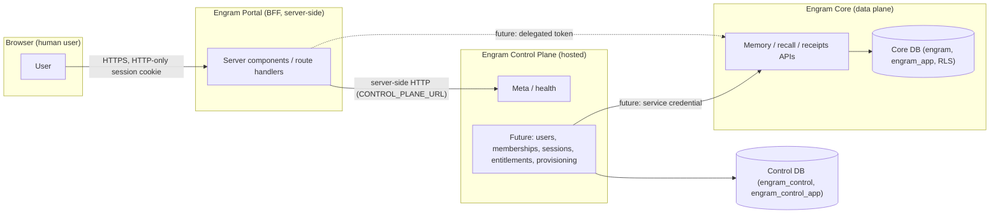
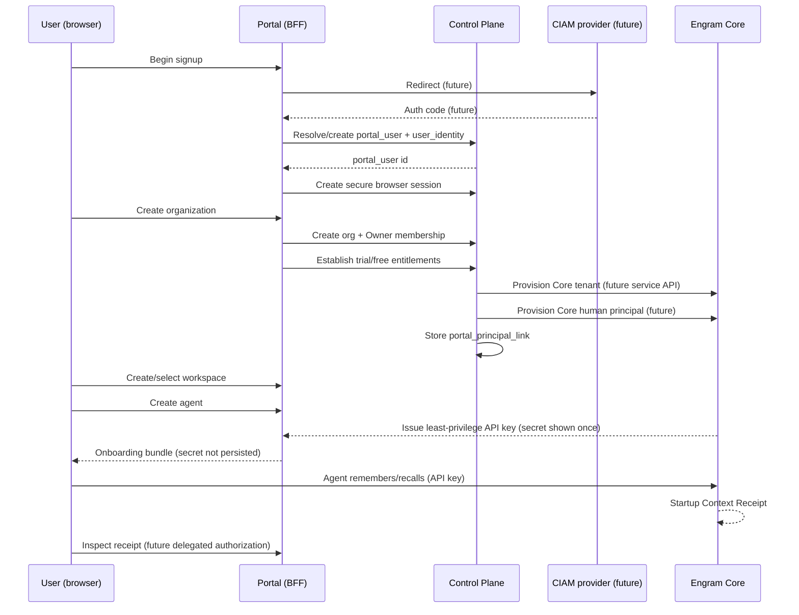
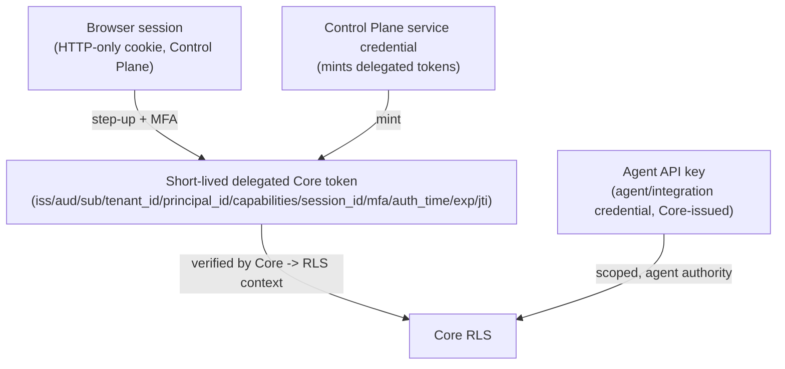

# Hosted Signup-to-First-Agent — Target Contract

- **Status:** Target contract, **not implemented behavior**
- **Scope:** ENG-PORTAL-001A (planning artifact)
- **Date:** 2026-07-24

> This document is a **target contract**, not implemented behavior. No production
> identity, billing, delegation, organization, or management behavior exists in
> ENG-PORTAL-001A. Each step records whether its endpoint currently exists.

## Service trust-boundary diagram

## Signup-to-first-agent sequence diagram

## Credential lifecycle diagram

## Step-by-step (target actors, APIs, state, credentials, idempotency, audit, failure)

For each step: actor, calling surface, target HTTP endpoint, Control Plane
entities read/written, Core entities read/written, credential type, required
hosted capability, required Core scope/service authority, idempotency/retry,
audit/security event, failure/compensation, and whether the endpoint currently
exists.

| # | Step | Actor | Surface | Target endpoint | Control Plane entities | Core entities | Credential | Hosted capability | Core scope/authority | Idempotency/retry | Audit/security event | Failure/compensation | Exists? |
|---|------|-------|---------|-----------------|------------------------|---------------|-----------|-------------------|---------------------|-------------------|----------------------|----------------------|---------|
| 1 | Begin signup | User | Browser→Portal→CIAM | CIAM authorize (future) | — | — | none (redirect) | signup | — | redirect idempotent | signup_started | redirect fail → error page | No (CIAM deferred) |
| 2 | Resolve/create portal_user + user_identity | Control Plane | CIAM callback→CP | POST /control/v1/users (future) | portal_user, user_identity (w) | — | CIAM id_token | user:create | — | idempotent on provider subject | user.created | conflict → link existing | No |
| 3 | Create secure browser session | Control Plane | CP | POST /control/v1/sessions (future) | browser_session (w) | — | session cookie (HTTP-only) | session:create | — | single active per auth | session.created | auth fail → 401 | No |
| 4 | Create organization | User | Portal→CP | POST /control/v1/orgs (future) | organization (w) | — | session | org:create | — | idempotency key | org.created | rollback org | No |
| 5 | Create Owner membership | Control Plane | CP | POST /control/v1/memberships (future) | membership (w) | — | service-internal | org:owner | — | idempotent on (org,user) | membership.created | rollback membership | No |
| 6 | Establish trial/free entitlements | Control Plane | CP | POST /control/v1/entitlements (future) | entitlement (w) | — | service-internal | entitlement:grant | — | upsert | entitlement.granted | — (no trust change) | No |
| 7 | Provision Core tenant | Control Plane | CP→Core | POST /svc/v1/tenants (future) | portal_tenant_link (w) | tenant (w) | CP service credential | tenant:provision | service authority | idempotent key | tenant.provisioned | retry then compensate | No |
| 8 | Provision Core human principal | Control Plane | CP→Core | POST /svc/v1/principals (future) | portal_principal_link (w) | principal (w) | CP service credential | principal:provision | service authority | idempotent key | principal.provisioned | rollback principal | No |
| 9 | Store portal_principal_link | Control Plane | CP | POST /control/v1/principal-links (future) | portal_principal_link (w) | — | service-internal | link:create | — | idempotent on (portal_user,principal) | link.created | rollback link | No |
| 10 | Create/select workspace | User | Portal→CP→Core | POST /control/v1/workspaces (future) | workspace_link (w) | workspace (w) | delegated token | workspace:create | write scope | idempotency key | workspace.created | rollback workspace | No |
| 11 | Create agent | User | Portal→CP→Core | POST /control/v1/agents (future) | agent_link (w) | principal (agent) (w) | delegated token | agent:create | write scope | idempotency key | agent.created | rollback agent | No |
| 12 | Issue least-privilege API key | Core | CP→Core | POST /svc/v1/keys (future) | — | api_key (w), secret returned once | CP service credential | key:issue | service authority | idempotency key; secret shown ONCE | api_key.issued | rollback key | No |
| 13 | Present onboarding bundle (no persisted secret) | Portal | Portal | GET /onboarding (future) | — | — | session | onboarding:view | — | read-only | — | — | No |
| 14 | Agent remembers/recalls data | Agent | Agent→Core | /v1/remember, /v1/recall (exist) | — | memory_items (w/r) | agent API key | — | read/write | — | write/read events | — | **Yes** (Core APIs exist) |
| 15 | Produce + inspect Context Receipt | Core/Portal | CP→Core; Portal→CP→Core | /v1/context-receipts (exist); future delegated inspect | — | context_receipts (w/r) | delegated token | receipt:inspect | read scope | read-only | receipt.inspected | — | **Partial** (Core receipt API exists; Portal inspect deferred) |

## Missing API inventory (target APIs that do not yet exist)

- Service-authenticated **Core tenant provisioning** API.
- **Core human principal provisioning** and **portal link binding** API.
- **Workspace lifecycle** APIs (hosted create/select).
- **Individual agent key lifecycle** APIs (hosted create + Core issue-once).
- **Delegated Core token exchange and verification** (ENG-DELEGATION-001).
- **Entitlement checks** (hosted).
- **Security-event recording** (hosted audit store).
- CIAM adapter + signup/session/org/membership endpoints (ENG-IDENTITY-001).

## Delegation contract (documented only; no token issued or accepted this slice)

Minimum future delegated-token claims: `iss`, `aud`, `sub`, `tenant_id`,
`principal_id`, `capabilities`, `session_id`, `mfa`, `auth_time`, `exp`, `jti`.

Rules (target):

- Short lifetime.
- Audience restricted to Engram Core.
- Core revalidates tenant and principal state before setting RLS context.
- Hosted capabilities are **not** blindly translated to Core admin scope.
- Revoked or locked browser sessions cannot mint new delegated credentials.
- **No delegated-token implementation is part of ENG-PORTAL-001A.**

## Human role contract

Roles (organization-scoped): **Owner, Administrator, Developer, Reviewer, Billing
administrator, Viewer**.

Rules:

- Roles are organization-scoped and map to explicit hosted capabilities.
- They do not map one-to-one to Core API-key scopes.
- The Billing administrator has no implicit memory-content access.
- The platform operator is not a tenant role (ADR 0009).
- Step-up requirements are documented but not implemented.
